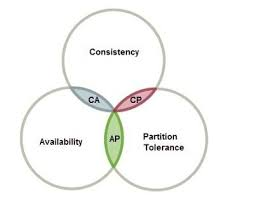

# К каким системам по CAP теореме относится MongoDB

В CAP говорится, что в распределенной системе возможно выбрать только 2 из 3-х свойств:

- C (consistency) — согласованность. Каждое чтение даст вам самую последнюю запись.
- A (availability) — доступность. Каждый узел (не упавший) всегда успешно выполняет запросы (на чтение и запись).
- P (partition tolerance) — устойчивость к распределению. Даже если между узлами нет связи, они продолжают работать независимо друг от друга.

Следующие пункты относятся к абстрактной распределенной БД MongoDB.

- MongoDB обеспечивает strong consistency, потому что это система с одним Master узлом, и все записи идут по умолчанию в него.
- Автоматическая смена мастера, в случае отделения его от остальных узлов.
- В случае разделения сети, система прекратит принимать записи до тех пор, пока не убедится, что может безопасно завершить их.

Таким образом, система может продолжать работу в случае разделения сети, но теряется CAP-availability всех узлов. Это CP система!

Проблемы CAP теоремы:

- Далёкие от реального мира определения
- В рамках разработки, выбор в основном лежит между CP и AP
- Множество систем — просто P
- Чистые AP и CP системы могут быть не тем, что ожидаешь

BASE — это своеобразный контраст ACID, который говорит нам, что истинная согласованность не может быть достигнута в реальном мире и не может быть смоделирована в высокомасштабируемых системах.

Что стоит за BASE:

- Basic Availability. Система отвечает на любой запрос, но этот ответ может быть содержать ошибку или несогласованные данные.
- Soft-state. Состояние системы может меняться со временем из-за изменений конечной согласованности.
- Eventual consistency (конечная согласованность). Система, в конечном итоге, станет согласованной. Она будет продолжать принимать данные и не будет проверять каждую транзакцию на согласованность.

Давайте узнаем что-то новое о MongoDB:

- Это ACID в ограниченном смысле на уровне документа.
- В случае распределенной системы — it's all about that BASE.
- В случае отсутствия разделений сети, система гарантирует, что чтение и запись будут согласованными.
- Если Master узел упадёт или потеряет связь с остальной системой, некоторые данные не будут реплицированы. Система выберет нового мастера, чтобы оставаться доступной для чтения и записи. (Новый мастер и старый мастер несогласованы).
- Система рассматривается как PA / EC (A), так как большинство узлов остаются CAP-available в случае разрыва. Помните, что в CAP MongoDB обычно рассматривается как CP. Создателль PACELC, Даниэль Дж. Абади, говорит, что существует гораздо больше проблем с согласованностью, чем с доступностью, поэтому PA.

[источник](https://habr.com/ru/post/328792/)