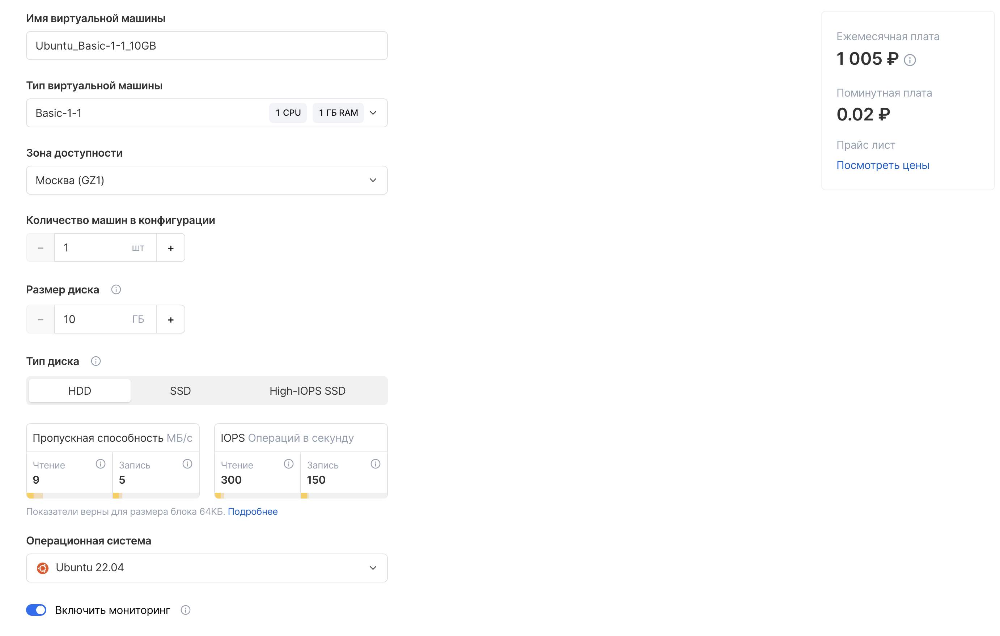
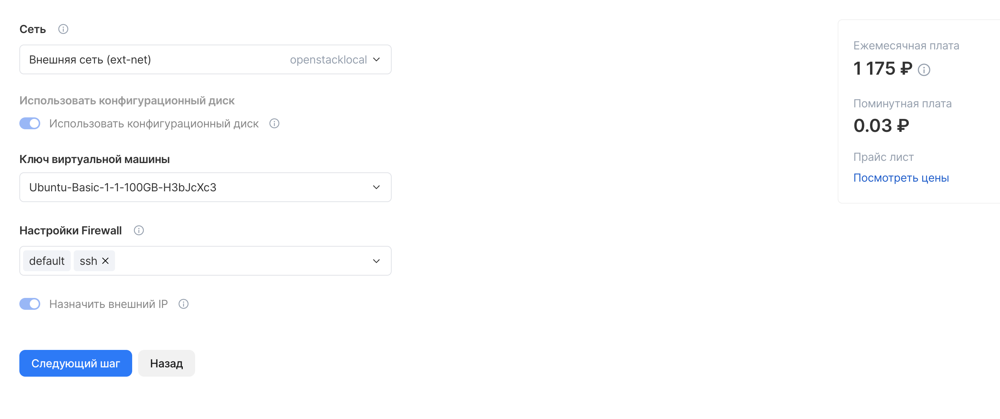
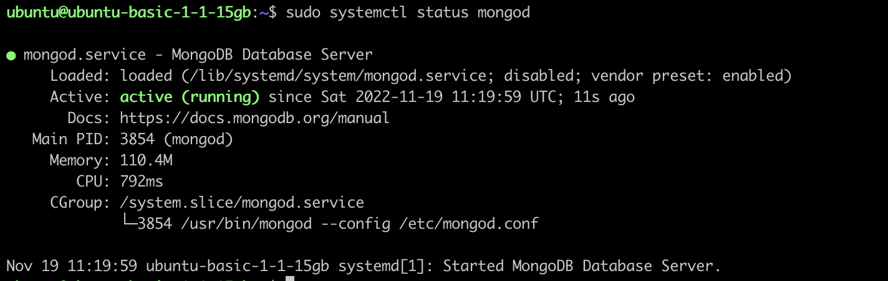
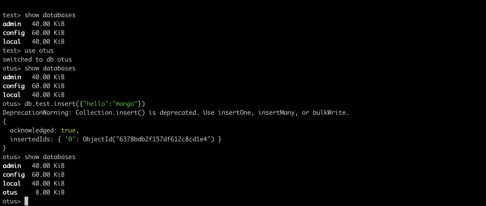
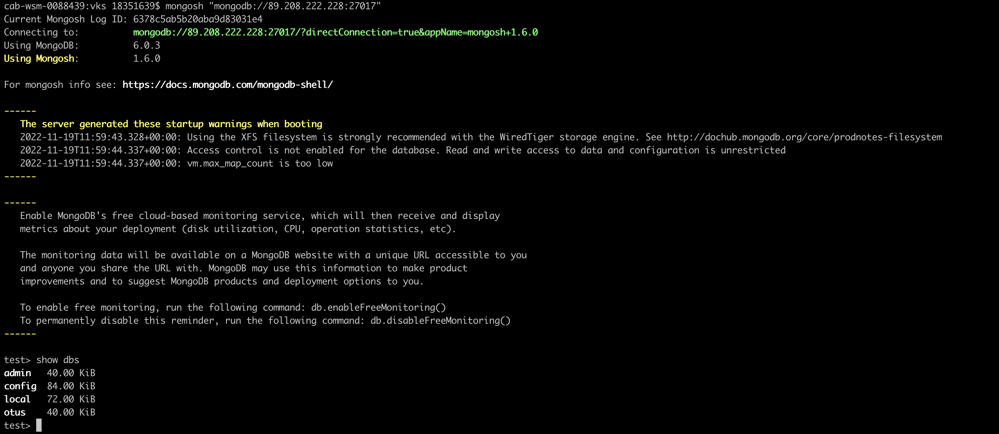

# Работа с MongoDB в ВМ

Создаём виртуальную машину в VK Cloud.


Подключаем сеть


подключение к вм через ssh по ключу
```bash
ssh -i vks.cer ubuntu@89.208.222.228
```

## Установка mongodb на виртуальную машину
1. Импортируем ключи
```bash
wget -qO - https://www.mongodb.org/static/pgp/server-6.0.asc | sudo apt-key add -
```

2. Cоздаём list файл
```bash
echo "deb [ arch=amd64,arm64 ] https://repo.mongodb.org/apt/ubuntu focal/mongodb-org/6.0 multiverse" | sudo tee /etc/apt/sources.list.d/mongodb-org-6.0.list
```
3. Перезагружаем пакеты
```bash
sudo apt-get update

```
4. Установка монго
```commandline
sudo apt-get install -y mongodb-org
```

Получаем ошибку
```
The following packages have unmet dependencies:
 mongodb-org-mongos : Depends: libssl1.1 (>= 1.1.1) but it is not installable
 mongodb-org-server : Depends: libssl1.1 (>= 1.1.1) but it is not installable
E: Unable to correct problems, you have held broken packages.
```

принудительная установка libssl1.1
```commandline
echo "deb http://security.ubuntu.com/ubuntu focal-security main" | sudo tee /etc/apt/sources.list.d/focal-security.list

sudo apt-get update
sudo apt-get install libssl1.1
```

```commandline
sudo apt-get install -y mongodb-org
```

## Запуск 

Запускаем монго
```commandline
sudo systemctl start mongod

```
проверяем статус
```commandline
sudo systemctl status mongod

```



Подключение к бд
```commandline
mongosh
```

Создаём базу



## Внешнее подключение

Разрешаем внешнее подключение к монге - добавляем адрес вм в конфиг
```commandline
sudo vim /etc/mongod.conf
```
```
net:
  port: 27017
  bindIp: 127.0.0.1,89.208.222.228
```
применяем конфигурацию
```commandline
sudo systemctl restart mongod
```
так же на фаерволле в настройках вм разрешаем внешние подключения

подключаемся
```commandline
mongosh "mongodb://89.208.222.228:27017"
```




Останавливаем монгу
```commandline
sudo service mongod stop

```