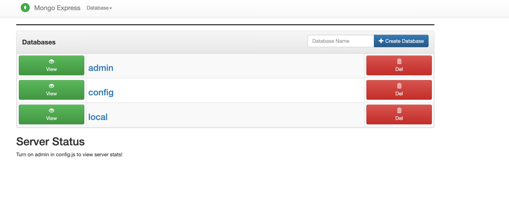
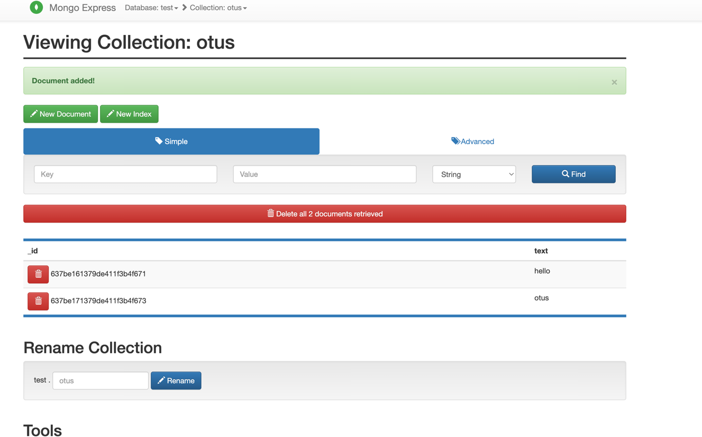
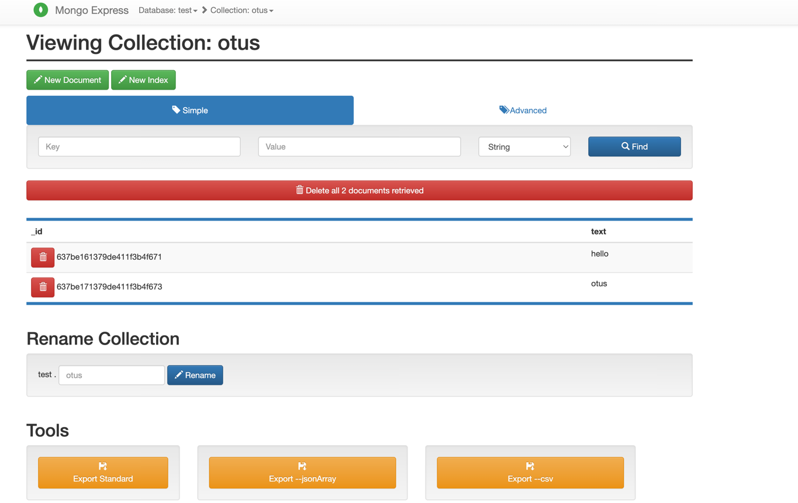

# Установка и настройка MongoDB в контейнере Docker

Создаём виртуальную машину в VK Cloud (см. [HW2](https://github.com/qDes/mongodb/blob/master/hw2/HW2.md#%D1%80%D0%B0%D0%B1%D0%BE%D1%82%D0%B0-%D1%81-mongodb-%D0%B2-%D0%B2%D0%BC))

## Установка Docker

Настройка репозитория
```commandline
sudo apt-get update
sudo apt-get install \
    ca-certificates \
    curl \
    gnupg \
    lsb-release
```

```commandline
sudo mkdir -p /etc/apt/keyrings
curl -fsSL https://download.docker.com/linux/ubuntu/gpg | sudo gpg --dearmor -o /etc/apt/keyrings/docker.gpg
```

```commandline
echo \
  "deb [arch=$(dpkg --print-architecture) signed-by=/etc/apt/keyrings/docker.gpg] https://download.docker.com/linux/ubuntu \
  $(lsb_release -cs) stable" | sudo tee /etc/apt/sources.list.d/docker.list > /dev/null
```

Установка Docker

```commandline
sudo apt-get update
```

```commandline
sudo apt-get install docker-ce docker-ce-cli containerd.io docker-compose-plugin
```
* docker-compose включен в поставку и доступен по команде `docker compose`

Создаём папку для монтирования в образ
```commandline
mkdir -p /data/mongo_data
```

Пишем простой композ с монгой и клиентом -
[docker-compose.yaml](docker-compose.yaml)


Запускаем композ c монгой и клиентом, в качестве клиента будет использован mongoexpress
```commandline
docker compose up -d
```
Для перситентости данные монги хранятся на диске через примонтированный volume
```
    volumes:
      - /data/mongo_data:/data/db
```

Клиент поднят на 8888 порту - заходим на него http://89.208.222.228:8888/



Создаем базу test и коллекцию otus, добавляем пару записей


Стопаем композ с очисткой анонимных вольюмюв (для чистоты эксперимента).
```commandline
docker compose down -v
```
Удаляем образы
```commandline
docker system prune -af
```
Запускаем композ
```commandline
docker compose up -d
```
Заходим на клиент - данные на месте

