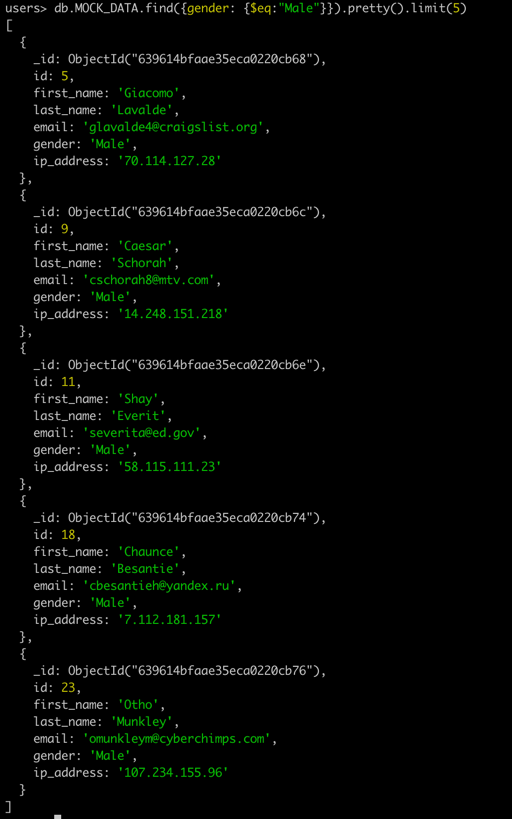

# Базовые запросы к MongoDB

Создаём виртуальную машину в VK Cloud (см. [HW2](https://github.com/qDes/mongodb/blob/master/hw2/HW2.md#%D1%80%D0%B0%D0%B1%D0%BE%D1%82%D0%B0-%D1%81-mongodb-%D0%B2-%D0%B2%D0%BC))

## Данные
С помощью сервиса https://mockaroo.com/ генерируем данные id,first_name,last_name,email,gender,ip_address в MOCK_DATA.json
Заливаем в монгу данные 
```commandline
mongoimport "mongodb://89.208.222.228:27017"  --db=users --jsonArray --file=MOCK_DATA.json
```

Заходим в базу
```commandline
mongosh "mongodb://89.208.222.228:27017"
```

Заходим в бд users и смотрим данные 
```commandline
use users
db.MOCK_DATA.find().pretty().limit(5)
```


Сортируем по полю id


Найдем записи с gender=Male
```commandline
db.MOCK_DATA.find({gender: {$eq:"Male"}}).pretty().limit(5)
```



Найдем записи с gender=Male или Female

```commandline
db.MOCK_DATA.find({ $or: [{gender: {$eq:"Male"}}, {gender: {$eq:"Female"}}]}).pretty().limit(5)
```


Обновим поле gender у документа с id = 1
```commandline
db.MOCK_DATA.updateOne({"id":1},{ $set: { "gender":"Polygender"}})
```


Удалим записи с gender != Male


